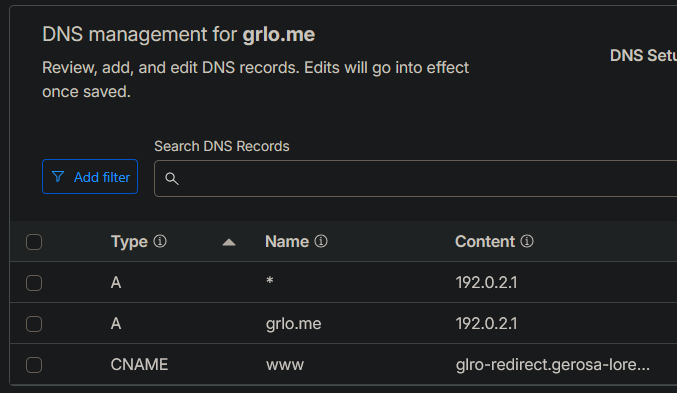
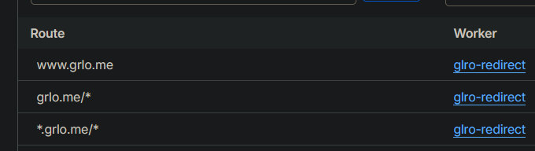

Oh boy did this make me pull some hair. Today we're going to see how, with a shortened domain, we can redirect every request to our main domain.

## Preface

In my example I'm going to use `gerosalorenzo.com`, the website you're visiting right now, and `grlo.me`, a shortened version that I've just bought in the hope of hosting a personal url shortener (not in my homeserver as I wouldn't want that dependent on my ability to keep my infrastructure up, just like this static website).

Small rant: [Shlink](https://shlink.io/) looks to be the most promising option but I would probably need to find a free vps tier that supports it or fall back to [something static](https://github.com/yusukebe/url-shortener) that supports deployment as a Cloudflare Worker using the free key-value storage that it comes with. This will also need to be behind some kind of authentication and would be beautiful to be integrated with something like sharex that I have set to a key combo to shorten current copied urls.

## The goal

As for now, the thing that I wanted to achieve was """simply""" redirect each and every combination of url from grlo.me to gerosalorenzo.com.
For each and everyone I really mean it. There's [easy fixes](https://www.youtube.com/redirect?event=video_description&redir_token=QUFFLUhqa1lhNUU2Wm5XVUtQWkxGMTgxd18ySzlHcE01Z3xBQ3Jtc0ttR2xWS2xGSkVxUW1IR0p3cGMxa01JeXB6c3RodjZfZm11TzFON19KRnJsV0w0dGh1RHNBQzN3OV9pRnVXMkZvM1JJai1ncGdsSWc5UW00OEhFMUdvOENrN1JDb09fcTJIYnBQRERoOTc4WTM0NGRMUQ&q=https%3A%2F%2Fonescales.com%2Fblogs%2Fmain%2Fcloudflare-redirect-old-domain-to-new&v=6bsai_5qZNU) to redirect just `grlo.me/gh` to `gerosalorenzo.com/gh`.

Also, the other reason, is to centralize bulk redirects.

## Guide

### Prerequisites

Go to your cloudflare dashboard and select the domain you want the redirects to work on (`grlo.me` in my example). Go to Rules>Overview and delete any rule you have in this section to avoid conflicts.

Then go to Rules>Page rules and do the same.

### DNS Setup

Now you can go on DNS>Records and add a couple of records like in the image. You won't have the worker url already to set in the content of the CNAME record but we'll see that in the next step.



We're using an internal ip address because we need a DNS record to exist, but it doesn’t need to point to anything real, because the Worker will always respond first. 192.0.2.1 will work fine for that. Could also use 127.0.0.1 (loopback).

### The worker

Create a new worker on your main dashboard (you need to get out of your domain settings, by clicking "Back to Domains").

Navigate to Compute&AI>Workers & Pages, select "Start with Hello World", and paste this code in, by changing my domains with yours

``` javascript
export default {
  async fetch(request) {
    const url = new URL(request.url);
    const host = url.hostname;
    const { pathname, search } = url;

    const suffix = '.grlo.me';

    // grlo.me or www.grlo.me → redirect to gerosalorenzo.com
    if (host === 'grlo.me' || host === 'www.grlo.me') {
      return Response.redirect(`https://gerosalorenzo.com${pathname}${search}`, 301);
    }

    // example.grlo.me → redirect to example.gerosalorenzo.com
    if (host.endsWith(suffix)) {
      const subdomain = host.slice(0, -suffix.length);
      return Response.redirect(`https://${subdomain}.gerosalorenzo.com${pathname}${search}`, 301);
    }

    return fetch(request);
  }
}

```

This will be the hearth of our redirects, it's the one processing the actual addresses and composing the right one.

You can now deploy it, check for any errors but you should be good to go.

### Connecting addresses

You can now go back into the shorter domain and into Worker Routes



You can now link the Routes to the worker we created on the previous step.

Update it in the dns records too (to the cname one) to match my first screenshot.

## Done!

Everything should be working, you can test it. By doing this the redirect rules you set in (my example) gerosalorenzo.com are usable in your shorter domain too, as it redirects exactly the same things in your url (included searches ad you can see in the code, so it could work for basically any type of shortcut for your website or shop).