This guide won't touch generic print calibration or any other print settings, you can follow my guide on best calibration settings order as you need a perfectly tuned printer to be able to print such small and precise things, especially with a larger size nozzle (mine is .6mm, i bet some keycaps can be printed on .8mm with a few more tweaks).

## Context

I've had my corne v4 keyboard for more than a year now, and i've bought it with no keycaps or keys since i had a 3d printer laying around and a spare set of keys. So i've printed a set, but since time was running low i stuck with a thicker keycap (nothing bad, even thockier if you prefer that), but recently i've found [this reddit post](https://www.reddit.com/r/ErgoMechKeyboards/comments/1so36jf/klp_lamé_on_cornix%2f) and tought "damn, i could use some new ergo keycaps since mine are flat and jump off the keyboard if i strike them too hard" (really, for future reference, pla keycaps don't wear on surface but the stem part becomes incredibly loose overtime, especially if you remove them somewhat frequently to fix them).

So with a couple of free hours on hand I've compiled this guide to suggest you the best slicer settings to get the best result possible. Enjoy :)

## Prerequisites

You obviously need a slicer, I'll be using Orcaslicer, but you find these settings in all the main ones, just with slightly different names.

Get the keycap you would like to print, you can do a standard flat one or even the accent keycaps with mini figurines on top of them, this guide improves quality for those too.

Get som petg, it has a worse finish than pla but the stem will stay more tight overtime, gripping the key better. 

## Modifiers

Part prep is as important as slicer settings, for the first step of this guide we'll cover print orientation and seam placememnt.

### Print orientation

45 degrees is the best way to print these, any other orientation on fdm and you'll be left with an ugly result.

### Adhesion improvement

By rotating to 45 you'll realize your keycap will likely be on an edge, and probably on a really thin one. On my example I've used the cut tool to remove .6mm of material from the bottom of the keycap. This way I can fit 2 full lines as the first layer of the keycap. That should be the metric, 2 complete lines should show on the first layer.

### Seam placement

That's crucial to control to make keycaps all uniform. I've enabled the seam modifier tool and did a vertical line on the back of the keycap, a line on the thicker portion of the stem, and a line on the upper portion, on the border side of the keycap to avoid that any seam would leak into the surface that the finger actually touches.

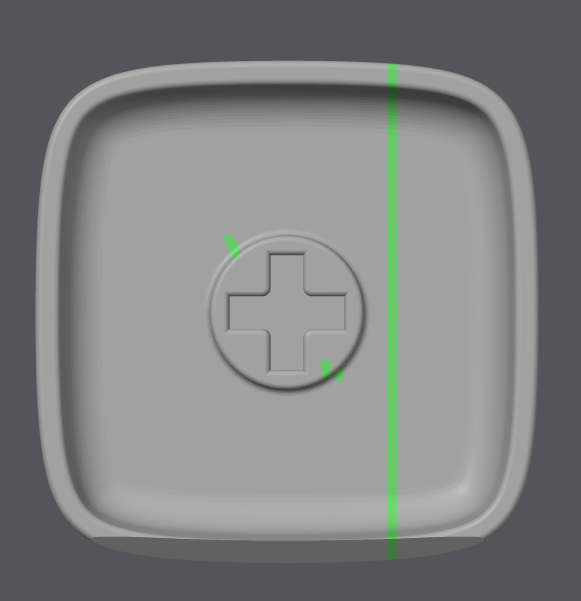

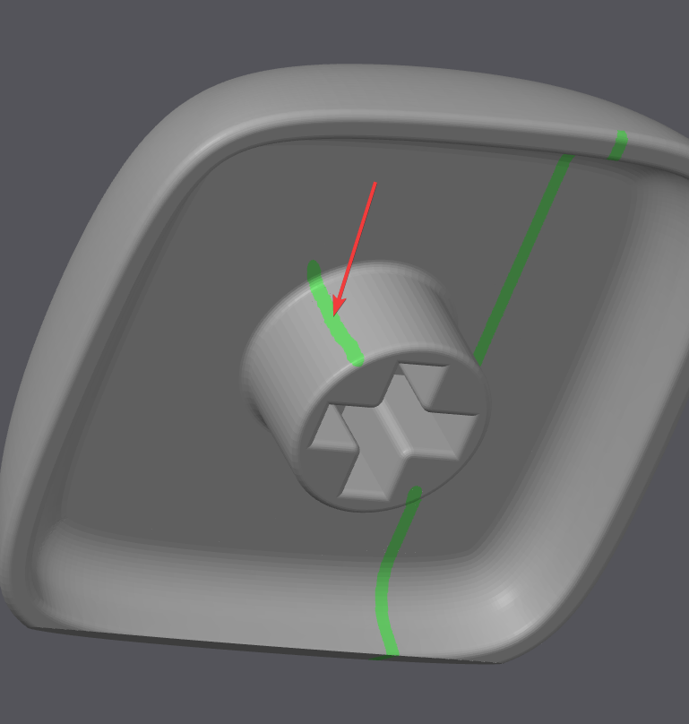

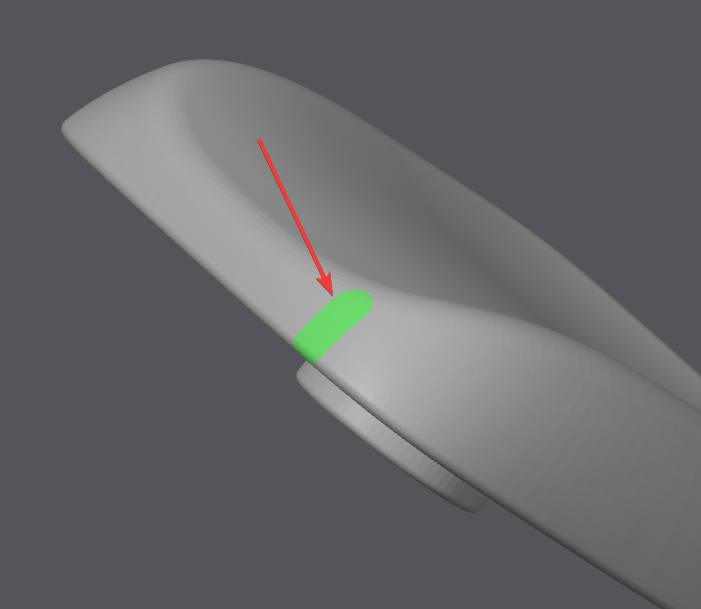

## Onto the settings

### Arachne, you can't without it.

Arachne, you can't without it. The other tweak is line width combined with Minimum Wall Width. On [these](https://github.com/braindefender/KLP-Lame-Keycaps/) keycaps (thin border) you're constrained to print them on a 45 degree slant to have a half decent result. This means you're going to print two of the sides with a 45 degree overhang (pla suggested for this, better than petg, even with supports) and with default arachne settings the tips of the thinnest loops merge into a single line.

The default setting is 85% and leads to this situation and artifacts:

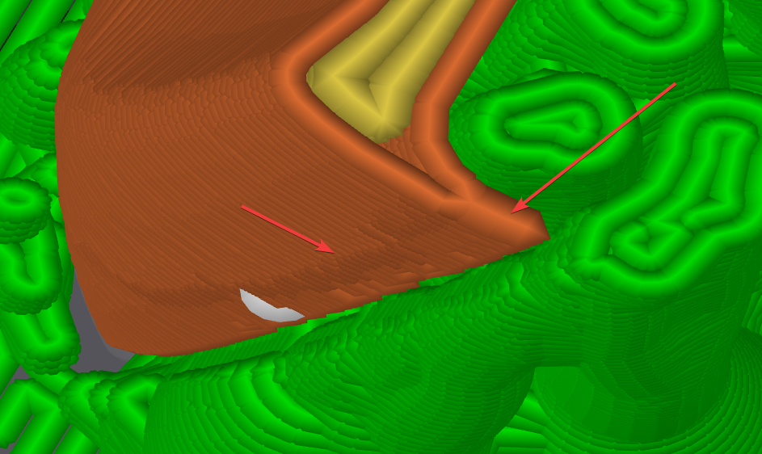

With a more aggressive setting (but not enough to fix the problem fully, 80% in my case), the effect is mitigated (lines get separated) but vertical artifacts are still present.

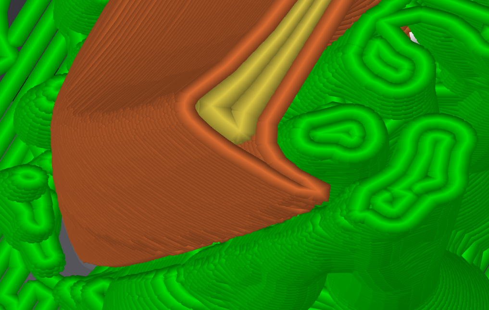

By setting Minimum Wall Width to 70% instead of the default 85% you are able to have tips that show like this:

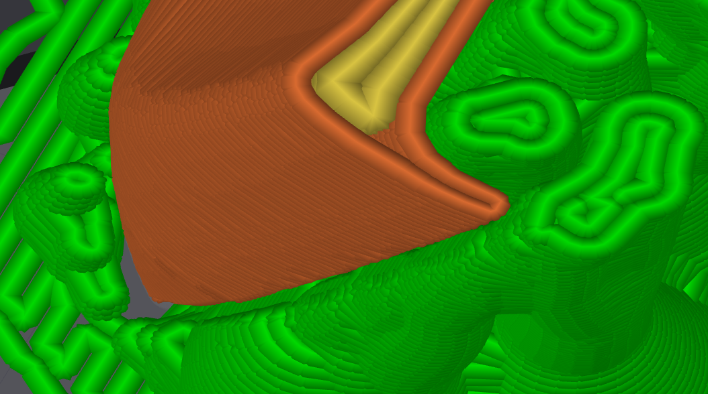

### Supports

Those need to be on and with a 40-45 degree threshold (especially with petg). This ensure the steam is propely supported and even the upper lip that gets created as a consequence of rotating to 45 degree the keycap. 

Raft

I've enabled it with 2 layers and .2mm of distance from the object so that the bottom part has a cleaner siding. Since, even when cut, it has a pretty thin surface of contact, having a raft makes those 2 thin lines possible and much easier to clean after the print.

### Wall count and infill

I printed them at 100% infill for better sound, there's no need strenght wise but hollow sounds worse.

### Lower your layer height

I went to .12 for best quality on my .6 nozzle. Not only does this improve looks, but also strengthens the sterm that's the crucial part of the print.

### Layer width

### Maybe

Fuzzy skin on the part that gets touched (by selecting the paint tool and having fuzzy skin set to "Paited Only") could improve perceived print quality, but would also lead to harder to clean keycaps. Worth tweaking tho, it looks like .4 spacing and .15 thickness is a good middle ground but it's pretty much personal preference.

## Results

There it is! all completed, for around 1 eur of material and replaceable at any time, doesn't get much better than this :)

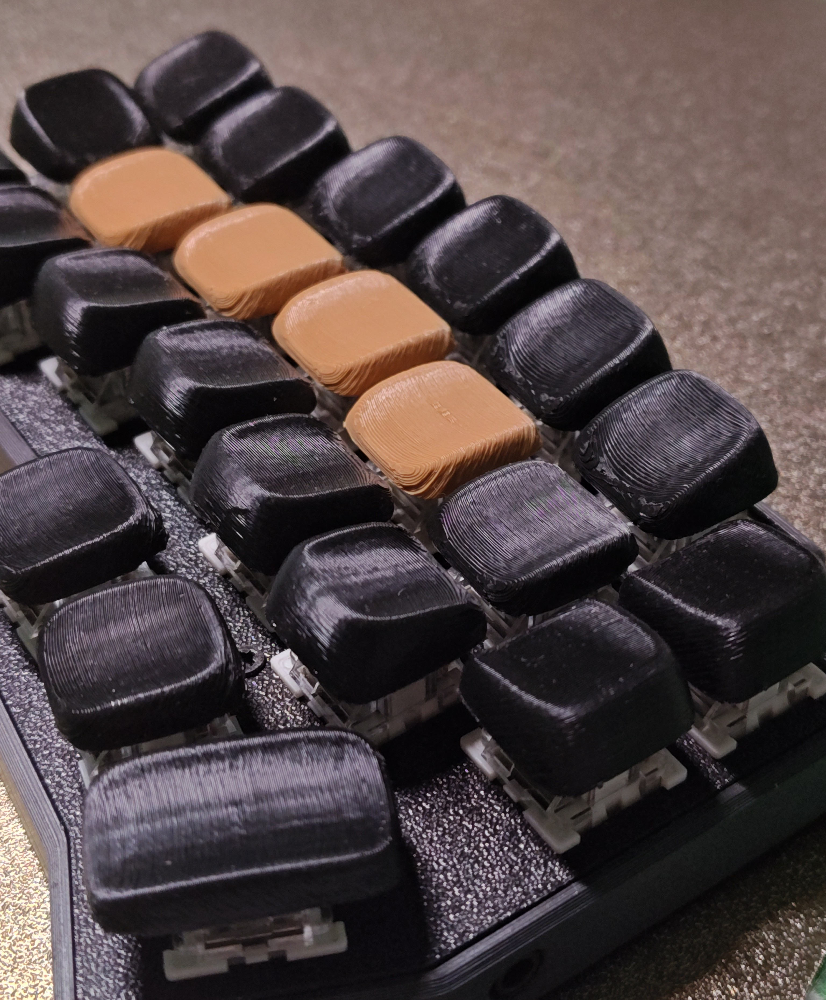

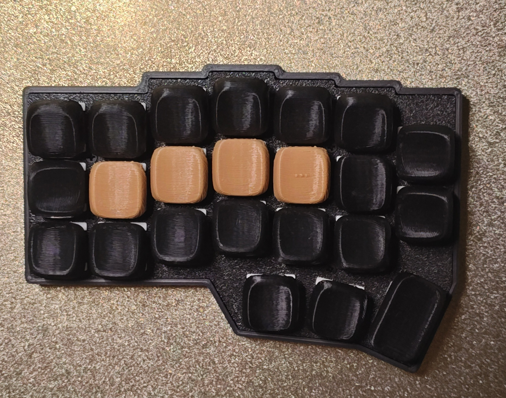

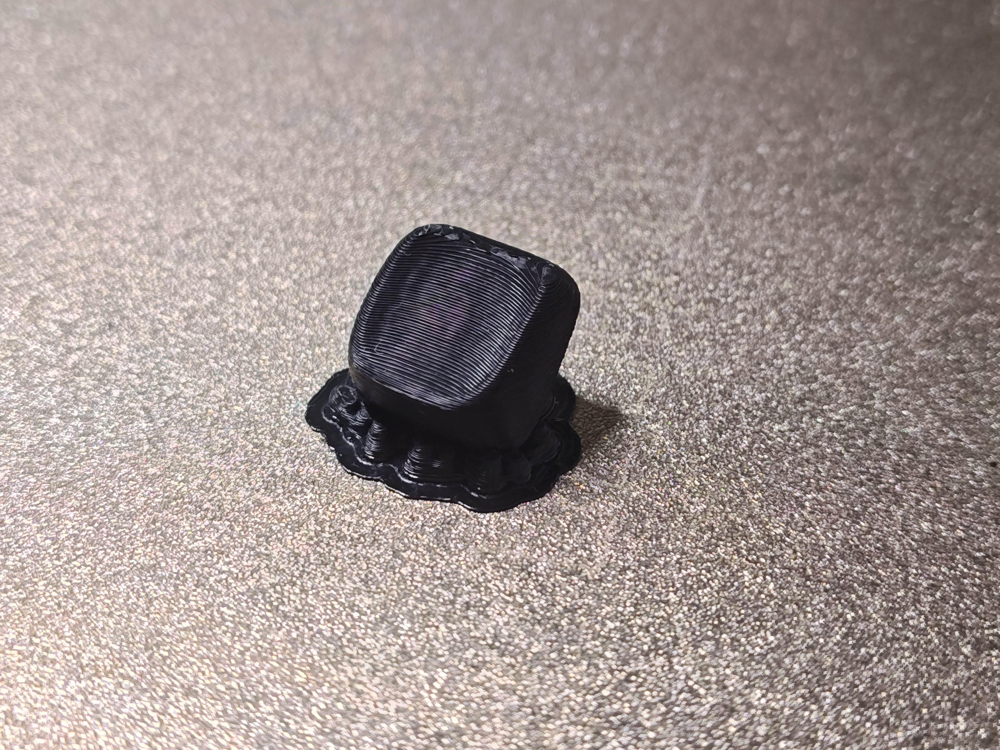

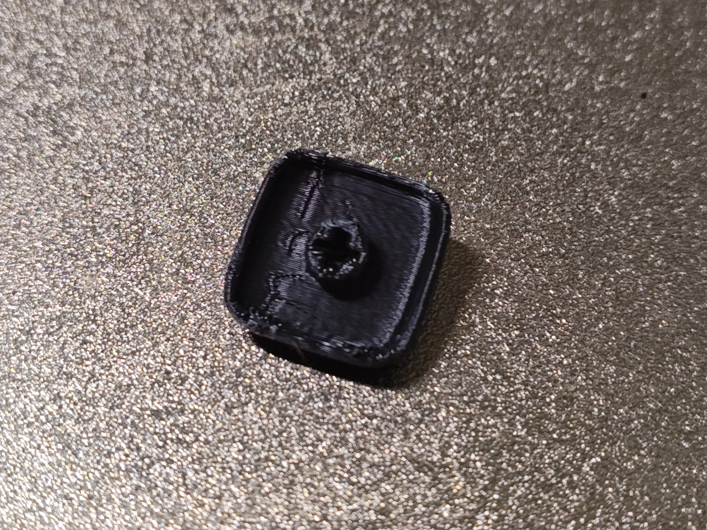

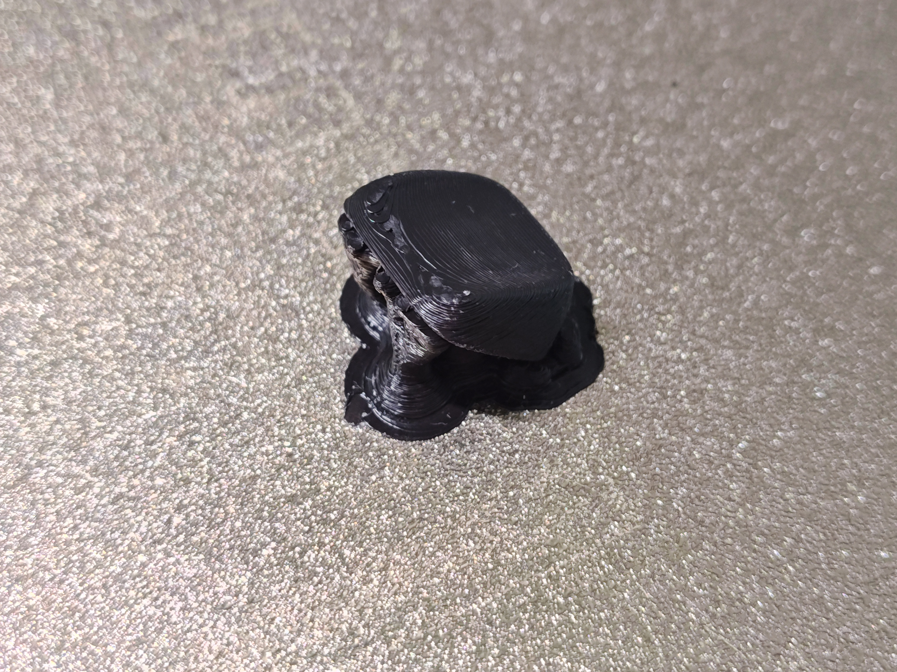
